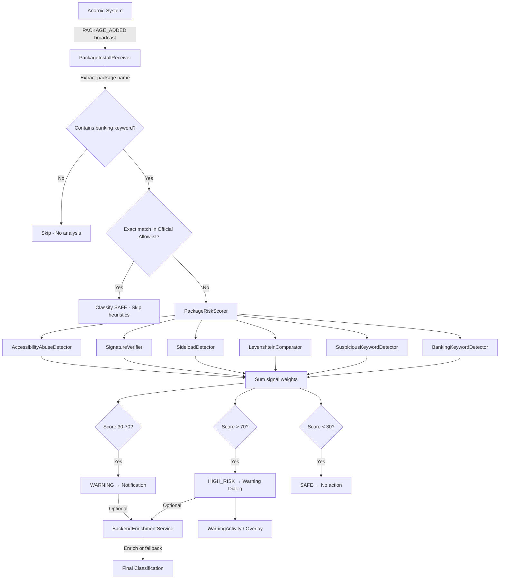
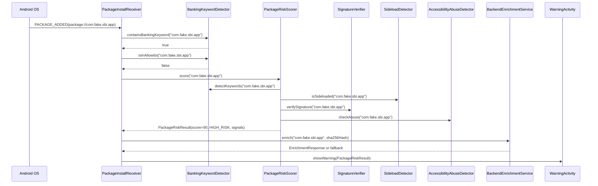
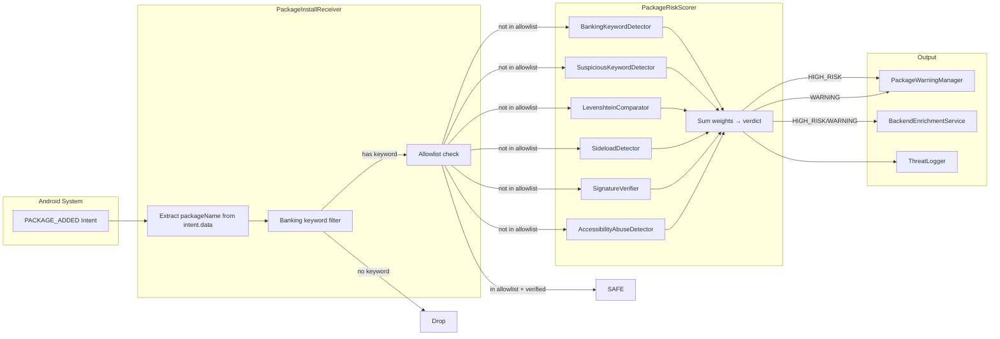

# Design Document: Banking App Verification

## Overview

Banking App Verification extends AnteClick's phishing protection from URL-based detection to identifying fake or impersonating banking apps at install time. The feature uses an event-driven architecture triggered exclusively by `PACKAGE_ADDED` system broadcasts, applies multi-signal heuristic risk scoring against known official banking app signatures, and warns users about suspicious financial apps without auto-removing them.

The design follows the same scoring pattern established by `ThreatScorer` (URL heuristics) but applies it to package names and app metadata. It is fully Play Store compliant — no `QUERY_ALL_PACKAGES`, no continuous scanning, no filesystem traversal.

### Design Goals

- **Event-driven only**: React to `PACKAGE_ADDED` broadcasts; never enumerate installed packages
- **Layered scoring**: Multiple independent heuristic signals summed into a cumulative risk score
- **Play Store safe**: No restricted permissions, no antivirus-like behavior, no auto-removal
- **Graceful degradation**: Backend enrichment is optional; local scoring works offline
- **Minimal footprint**: No foreground service, no persistent background work

## Architecture

### High-Level System Diagram



### Component Interaction Sequence



## Components and Interfaces

### 1. PackageInstallReceiver

**Location**: `com.anteclick.app.receiver.PackageInstallReceiver`

A manifest-declared `BroadcastReceiver` that listens for `PACKAGE_ADDED` events. Manifest declaration ensures it works even when the app process is not running and in low-power states without a foreground service.

```kotlin
class PackageInstallReceiver : BroadcastReceiver() {
    override fun onReceive(context: Context, intent: Intent) {
        if (intent.action != Intent.ACTION_PACKAGE_ADDED) return
        if (intent.getBooleanExtra(Intent.EXTRA_REPLACING, false)) return

        val packageName = intent.data?.schemeSpecificPart ?: return
        // Delegate to coroutine for async processing
        goAsync().let { pendingResult ->
            CoroutineScope(Dispatchers.Default).launch {
                try {
                    processPackage(context, packageName)
                } finally {
                    pendingResult.finish()
                }
            }
        }
    }
}
```

**Manifest declaration**:
```xml
<receiver
    android:name=".receiver.PackageInstallReceiver"
    android:exported="true"
    android:enabled="true">
    <intent-filter>
        <action android:name="android.intent.action.PACKAGE_ADDED" />
        <data android:scheme="package" />
    </intent-filter>
</receiver>
```

### 2. BankingKeywordDetector

**Location**: `com.anteclick.app.verification.BankingKeywordDetector`

Pure function component that determines whether a package name is banking-related. Performs case-insensitive matching against a curated keyword list.

```kotlin
object BankingKeywordDetector {

    val bankingKeywords = listOf(
        "sbi", "hdfc", "icici", "axis", "upi", "paytm",
        "phonepe", "gpay", "bank", "wallet", "finance", "payment"
    )

    val officialAllowlist = mapOf(
        "com.sbi.lotusintouch" to "SHA256_HASH_SBI",
        "com.snapwork.hdfc" to "SHA256_HASH_HDFC",
        "com.phonepe.app" to "SHA256_HASH_PHONEPE",
        "net.one97.paytm" to "SHA256_HASH_PAYTM",
        "com.google.android.apps.nbu.paisa.user" to "SHA256_HASH_GPAY",
        "com.csam.icici.bank.imobile" to "SHA256_HASH_ICICI"
    )

    fun containsBankingKeyword(packageName: String): Boolean
    fun isInAllowlist(packageName: String): Boolean
}
```

### 3. SuspiciousKeywordDetector

**Location**: `com.anteclick.app.verification.SuspiciousKeywordDetector`

Detects social engineering keywords in package names that indicate phishing intent.

```kotlin
object SuspiciousKeywordDetector {

    val suspiciousKeywords = listOf(
        "verify", "secure", "reward", "gift", "kyc",
        "update", "loan", "claim", "bonus", "otp"
    )

    fun detectSuspiciousKeywords(packageName: String): List<PackageRiskSignal>
}
```

### 4. LevenshteinComparator

**Location**: `com.anteclick.app.verification.LevenshteinComparator`

Detects typosquatting by computing edit distance between the installed package name and official banking package names. Reuses the same Levenshtein algorithm pattern from `ThreatScorer`.

```kotlin
object LevenshteinComparator {

    private val officialPackageNames = listOf(
        "com.sbi.lotusintouch",
        "com.snapwork.hdfc",
        "com.phonepe.app",
        "net.one97.paytm",
        "com.google.android.apps.nbu.paisa.user",
        "com.csam.icici.bank.imobile"
    )

    fun levenshtein(a: String, b: String): Int
    fun isTyposquatting(packageName: String): Boolean
    fun getClosestMatch(packageName: String): Pair<String, Int>?
}
```

### 5. SideloadDetector

**Location**: `com.anteclick.app.verification.SideloadDetector`

Determines whether a package was installed from a source other than the Google Play Store using `PackageManager.getInstallSourceInfo()` (API 30+, available on our minSdk 31).

```kotlin
object SideloadDetector {

    private const val PLAY_STORE_PACKAGE = "com.android.vending"

    fun isSideloaded(context: Context, packageName: String): Boolean
}
```

### 6. SignatureVerifier

**Location**: `com.anteclick.app.verification.SignatureVerifier`

Compares the installed app's signing certificate SHA-256 hash against known official hashes. Uses `PackageManager.GET_SIGNING_CERTIFICATES` flag (API 28+).

```kotlin
object SignatureVerifier {

    fun getSigningCertHash(context: Context, packageName: String): String?
    fun verifySignature(context: Context, packageName: String): SignatureResult
}

enum class SignatureResult {
    VERIFIED,       // Hash matches official
    MISMATCH,       // Hash does not match
    NOT_IN_ALLOWLIST, // Package not in allowlist, skip verification
    UNAVAILABLE     // Could not retrieve signing info
}
```

### 7. AccessibilityAbuseDetector

**Location**: `com.anteclick.app.verification.AccessibilityAbuseDetector`

Checks whether a suspicious banking app declares an AccessibilityService or requests `SYSTEM_ALERT_WINDOW` permission — common banking trojan techniques.

```kotlin
object AccessibilityAbuseDetector {

    fun checkForAbuse(context: Context, packageName: String): List<PackageRiskSignal>
}
```

### 8. PackageRiskScorer

**Location**: `com.anteclick.app.verification.PackageRiskScorer`

Orchestrates all detectors and computes the cumulative risk score. Follows the same pattern as `ThreatScorer` but for package metadata instead of URLs.

```kotlin
object PackageRiskScorer {

    fun score(context: Context, packageName: String): PackageRiskResult
}
```

### 9. BackendEnrichmentService

**Location**: `com.anteclick.app.verification.BackendEnrichmentService`

Optional remote enrichment that queries the backend API for additional threat intelligence. Falls back gracefully to local scoring on any failure.

```kotlin
object BackendEnrichmentService {

    suspend fun enrich(
        packageName: String,
        certHash: String?,
        localResult: PackageRiskResult
    ): PackageRiskResult
}
```

### 10. PackageWarningManager

**Location**: `com.anteclick.app.verification.PackageWarningManager`

Displays warnings to the user, reusing the existing `WarningActivity` infrastructure. Shows a dialog for HIGH_RISK and a notification for WARNING.

```kotlin
object PackageWarningManager {

    fun showHighRiskWarning(context: Context, result: PackageRiskResult)
    fun showWarningNotification(context: Context, result: PackageRiskResult)
}
```

## Data Models

### PackageRiskSignal

Typed enum of every heuristic signal the package scorer can fire. Mirrors the pattern of `ThreatSignal` for URLs.

```kotlin
enum class PackageRiskSignal(val weight: Int, val label: String) {
    BANKING_KEYWORD       (20, "Banking keyword in package name"),
    SUSPICIOUS_KEYWORD    (20, "Suspicious keyword in package name"),
    SIDELOADED            (30, "Installed outside Play Store"),
    SIGNATURE_MISMATCH    (40, "Signing certificate mismatch"),
    LEVENSHTEIN_TYPOSQUAT (25, "Package name similar to official app"),
    ACCESSIBILITY_ABUSE   (40, "Declares AccessibilityService or overlay permission")
}
```

### PackageRiskResult

The output of the scoring pipeline for a single package.

```kotlin
data class PackageRiskResult(
    val packageName: String,
    val score: Int,
    val verdict: ThreatVerdict,  // Reuses existing enum: SAFE, WARNING, HIGH_RISK
    val signals: List<PackageRiskSignal>,
    val reasons: List<String>,
    val certHash: String? = null,
    val installerPackage: String? = null
)
```

### OfficialBankingApp

Entry in the official allowlist with package name and expected signing certificate hash.

```kotlin
data class OfficialBankingApp(
    val packageName: String,
    val expectedCertHash: String,
    val displayName: String
)
```

### BackendPackageResponse

Response from the backend enrichment API.

```kotlin
data class BackendPackageResponse(
    val packageName: String,
    val verdict: String,        // "SAFE", "WARNING", "HIGH_RISK"
    val confidence: Int,        // 0-100
    val knownMalware: Boolean,
    val source: String          // "backend"
)
```

### Scoring Algorithm (Low-Level Design)

The `PackageRiskScorer.score()` function follows this algorithm:

```
FUNCTION score(context, packageName):
    // Step 0: Allowlist bypass
    IF packageName IN officialAllowlist:
        certResult = SignatureVerifier.verifySignature(context, packageName)
        IF certResult == VERIFIED:
            RETURN PackageRiskResult(score=0, verdict=SAFE, signals=empty)
        // If signature mismatch on allowlist package, continue scoring

    signals = mutableListOf()
    
    // Step 1: Banking keyword detection
    IF BankingKeywordDetector.containsBankingKeyword(packageName):
        signals.add(BANKING_KEYWORD)
    
    // Step 2: Suspicious keyword detection
    signals.addAll(SuspiciousKeywordDetector.detectSuspiciousKeywords(packageName))
    
    // Step 3: Levenshtein typosquatting
    IF LevenshteinComparator.isTyposquatting(packageName):
        signals.add(LEVENSHTEIN_TYPOSQUAT)
    
    // Step 4: Sideload detection
    IF SideloadDetector.isSideloaded(context, packageName):
        signals.add(SIDELOADED)
    
    // Step 5: Signature verification (for non-allowlist packages with banking keywords)
    certResult = SignatureVerifier.verifySignature(context, packageName)
    IF certResult == MISMATCH:
        signals.add(SIGNATURE_MISMATCH)
    ELSE IF certResult == VERIFIED:
        RETURN PackageRiskResult(score=0, verdict=SAFE, signals=empty)
    
    // Step 6: Accessibility abuse detection
    signals.addAll(AccessibilityAbuseDetector.checkForAbuse(context, packageName))
    
    // Step 7: Compute score (additive)
    totalScore = signals.sumOf { it.weight }
    
    // Step 8: Classify
    verdict = WHEN:
        totalScore > 70  -> HIGH_RISK
        totalScore >= 30 -> WARNING
        else             -> SAFE
    
    RETURN PackageRiskResult(packageName, totalScore, verdict, signals, ...)
```

### Levenshtein Distance Algorithm

Reuses the same DP implementation from `ThreatScorer.levenshtein()` — O(m×n) time, O(n) space. Package names are short (<100 chars) so this is fast.

```
FUNCTION levenshtein(a: String, b: String): Int
    // Standard Wagner-Fischer algorithm
    // Returns minimum edit distance (insertions, deletions, substitutions)
```

**Typosquatting threshold**: Edit distance 1–3 from any official package name, excluding exact matches (distance 0).

### Sideload Detection Algorithm

```
FUNCTION isSideloaded(context, packageName): Boolean
    TRY:
        installSourceInfo = context.packageManager.getInstallSourceInfo(packageName)
        installerPackage = installSourceInfo.installingPackageName
        IF installerPackage == null OR installerPackage.isBlank():
            RETURN true  // Unknown source = sideloaded
        RETURN installerPackage != "com.android.vending"
    CATCH NameNotFoundException:
        RETURN true  // Package not found = treat as sideloaded
```

### Signature Verification Algorithm

```
FUNCTION verifySignature(context, packageName): SignatureResult
    officialHash = officialAllowlist[packageName]?.expectedCertHash
    IF officialHash == null:
        RETURN NOT_IN_ALLOWLIST

    TRY:
        packageInfo = context.packageManager.getPackageInfo(
            packageName, PackageManager.GET_SIGNING_CERTIFICATES
        )
        signingInfo = packageInfo.signingInfo ?: RETURN UNAVAILABLE
        
        // Get current signer (handles both single and multiple signers)
        signatures = IF signingInfo.hasMultipleSigners():
            signingInfo.apkContentsSigners
        ELSE:
            signingInfo.signingCertificateHistory
        
        FOR cert IN signatures:
            hash = sha256Hex(cert.toByteArray())
            IF hash == officialHash:
                RETURN VERIFIED
        
        RETURN MISMATCH
    CATCH Exception:
        RETURN UNAVAILABLE
```

### Accessibility Abuse Detection Algorithm

```
FUNCTION checkForAbuse(context, packageName): List<PackageRiskSignal>
    signals = mutableListOf()
    TRY:
        packageInfo = context.packageManager.getPackageInfo(
            packageName,
            PackageManager.GET_PERMISSIONS or PackageManager.GET_SERVICES
        )
        
        // Check for SYSTEM_ALERT_WINDOW permission
        requestedPermissions = packageInfo.requestedPermissions ?: emptyArray()
        IF "android.permission.SYSTEM_ALERT_WINDOW" IN requestedPermissions:
            signals.add(ACCESSIBILITY_ABUSE)
            RETURN signals  // One signal max
        
        // Check for AccessibilityService declaration
        services = packageInfo.services ?: emptyArray()
        FOR service IN services:
            IF service.permission == "android.permission.BIND_ACCESSIBILITY_SERVICE":
                signals.add(ACCESSIBILITY_ABUSE)
                RETURN signals  // One signal max
    CATCH Exception:
        // Cannot inspect package — skip this check
    
    RETURN signals
```

### Data Flow Diagram



## Correctness Properties

*A property is a characteristic or behavior that should hold true across all valid executions of a system — essentially, a formal statement about what the system should do. Properties serve as the bridge between human-readable specifications and machine-verifiable correctness guarantees.*

### Property 1: Banking keyword detection is bidirectional and case-insensitive

*For any* package name string, the `BankingKeywordDetector.containsBankingKeyword()` function SHALL return `true` if and only if the package name contains at least one banking keyword (sbi, hdfc, icici, axis, upi, paytm, phonepe, gpay, bank, wallet, finance, payment) regardless of character casing, and `false` otherwise.

**Validates: Requirements 1.3, 2.1, 2.2, 2.4**

### Property 2: Suspicious keyword detection produces exactly one signal per keyword

*For any* package name string containing exactly one suspicious keyword (verify, secure, reward, gift, kyc, update, loan, claim, bonus, otp) in any case variation, the `SuspiciousKeywordDetector.detectSuspiciousKeywords()` function SHALL produce exactly one `SUSPICIOUS_KEYWORD` signal regardless of the keyword's position within the string.

**Validates: Requirements 3.1, 3.2, 3.3**

### Property 3: Levenshtein typosquatting detection flags near-matches

*For any* package name string that has a Levenshtein edit distance of 1 to 3 from any official banking package name in the allowlist, the `LevenshteinComparator.isTyposquatting()` function SHALL return `true`. For exact matches (distance 0) it SHALL return `false`.

**Validates: Requirements 4.1, 4.2**

### Property 4: Levenshtein implementation correctness

*For any* two strings `a` and `b`, the `LevenshteinComparator.levenshtein(a, b)` function SHALL produce the same integer result as a naive recursive reference implementation of edit distance.

**Validates: Requirements 4.4**

### Property 5: Sideload detection for non-Play-Store sources

*For any* installer package name that is not `"com.android.vending"`, including null and empty strings, the `SideloadDetector.isSideloaded()` function SHALL return `true`. For installer package name `"com.android.vending"` it SHALL return `false`.

**Validates: Requirements 5.1, 5.2, 5.4**

### Property 6: Signature match overrides all other signals

*For any* package whose signing certificate SHA-256 hash matches the official hash in the allowlist, the `PackageRiskScorer.score()` function SHALL return a `PackageRiskResult` with `score = 0` and `verdict = SAFE`, regardless of what other heuristic signals would have fired.

**Validates: Requirements 6.3, 6.5, 8.6**

### Property 7: Risk score is additive

*For any* subset of `PackageRiskSignal` values, the computed risk score SHALL equal the arithmetic sum of the individual signal weights. That is, `score = signals.sumOf { it.weight }`.

**Validates: Requirements 8.1, 8.5**

### Property 8: Risk classification follows threshold rules

*For any* computed risk score, the verdict SHALL be `HIGH_RISK` when score > 70, `WARNING` when score is in [30, 70], and `SAFE` when score < 30.

**Validates: Requirements 8.2, 8.3, 8.4**

### Property 9: Warning displays all fired signals

*For any* `PackageRiskResult` with one or more signals, the warning display SHALL include a human-readable description for every signal in the result's signal list.

**Validates: Requirements 9.2**

### Property 10: Backend fallback preserves local score

*For any* API failure condition (timeout, network error, HTTP error, malformed response), the `BackendEnrichmentService.enrich()` function SHALL return the original `localResult` unchanged.

**Validates: Requirements 11.2**

## Error Handling

### BroadcastReceiver Errors

| Error Condition | Handling Strategy |
|---|---|
| `intent.data` is null | Return immediately — no package to analyze |
| `EXTRA_REPLACING` is true | Skip — this is an update, not a new install |
| `goAsync()` timeout (10s ANR limit) | Processing is async via coroutine; `pendingResult.finish()` called in finally block |
| Coroutine exception | Caught in try/finally; receiver completes gracefully |

### PackageManager Errors

| Error Condition | Handling Strategy |
|---|---|
| `NameNotFoundException` | Package was uninstalled between broadcast and analysis — skip |
| `GET_SIGNING_CERTIFICATES` returns null `signingInfo` | Return `SignatureResult.UNAVAILABLE` — do not add mismatch signal |
| `getInstallSourceInfo` throws | Treat as sideloaded (conservative approach) |
| `getPackageInfo` with `GET_SERVICES` fails | Skip accessibility abuse check — do not add signal |

### Backend Enrichment Errors

| Error Condition | Handling Strategy |
|---|---|
| Network timeout (8s) | Fall back to local result |
| HTTP 4xx/5xx | Fall back to local result |
| Malformed JSON response | Fall back to local result |
| Backend returns lower severity than local | Use the higher severity (local wins) |

### General Principles

- **Fail open for detection**: If a detector cannot run, skip its signal rather than blocking the pipeline
- **Fail closed for allowlist**: If signature verification fails (UNAVAILABLE), do NOT classify as SAFE — continue with other heuristics
- **Never crash**: All exceptions are caught at the receiver level; the app continues functioning
- **Never block UI**: All processing is on `Dispatchers.Default`; warning display posts to main thread

## Testing Strategy

### Property-Based Testing (Kotest Property)

The project already uses **Kotest Property** (`io.kotest:kotest-property`) for property-based testing. Each correctness property maps to a single property-based test with minimum 100 iterations.

**Library**: `io.kotest:kotest-property` (already in `build.gradle.kts`)
**Runner**: JUnit 5 Platform with Kotest runner
**Minimum iterations**: 100 per property test

**Tag format**: `// Feature: banking-app-verification, Property {N}: {title}`

#### Property Tests

| Property | Test Class | What It Generates |
|---|---|---|
| P1: Banking keyword bidirectional | `BankingKeywordDetectorPropertyTest` | Random package name strings with/without keywords, random case |
| P2: Suspicious keyword single signal | `SuspiciousKeywordDetectorPropertyTest` | Random strings with exactly one suspicious keyword at random positions |
| P3: Levenshtein typosquatting | `LevenshteinComparatorPropertyTest` | Strings at edit distances 0-5 from official names |
| P4: Levenshtein correctness | `LevenshteinCorrectnessPropertyTest` | Random string pairs (bounded length ≤ 30) |
| P5: Sideload detection | `SideloadDetectorPropertyTest` | Random installer package names including null/empty |
| P6: Signature override | `PackageRiskScorerPropertyTest` | Random signal combinations with matching signature |
| P7: Score additivity | `PackageRiskScorerPropertyTest` | Random subsets of PackageRiskSignal enum values |
| P8: Classification thresholds | `PackageRiskScorerPropertyTest` | Random integer scores in range [0, 175] |
| P9: Warning signal completeness | `PackageWarningManagerPropertyTest` | Random PackageRiskResult with 1-6 signals |
| P10: Backend fallback | `BackendEnrichmentPropertyTest` | Random error conditions + local results |

### Unit Tests (Example-Based)

| Component | Key Test Cases |
|---|---|
| `BankingKeywordDetector` | Allowlist exact matches → SAFE; edge cases (empty string, unicode) |
| `SignatureVerifier` | Known good hash → VERIFIED; known bad hash → MISMATCH |
| `PackageInstallReceiver` | EXTRA_REPLACING=true → skip; null data → skip |
| `PackageWarningManager` | HIGH_RISK → dialog; WARNING → notification; SAFE → nothing |

### Integration Tests

| Scenario | What It Verifies |
|---|---|
| End-to-end receiver flow | Simulated PACKAGE_ADDED intent triggers full scoring pipeline |
| Backend enrichment | MockWebServer returns enrichment data; verify incorporation |
| Backend failure | MockWebServer returns 500; verify fallback to local score |
| Manifest declaration | Receiver is declared with correct intent-filter |

### Test Configuration

```kotlin
// Property test example structure
class BankingKeywordDetectorPropertyTest : FunSpec({
    test("Property 1: Banking keyword detection is bidirectional and case-insensitive") {
        // Feature: banking-app-verification, Property 1: Banking keyword detection
        checkAll(100, Arb.string(1..80)) { packageName ->
            val result = BankingKeywordDetector.containsBankingKeyword(packageName)
            val expected = BankingKeywordDetector.bankingKeywords.any {
                packageName.lowercase().contains(it.lowercase())
            }
            result shouldBe expected
        }
    }
})
```

