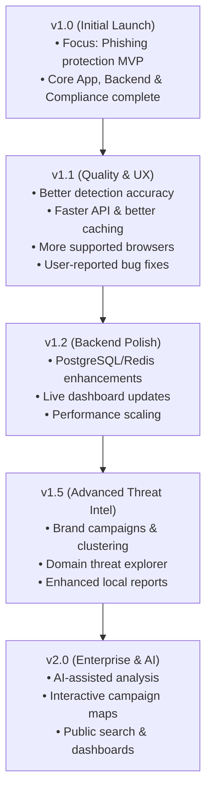

# AnteClick Release Strategy & Roadmap

## Core Philosophy: Stable & Focused MVP First

> **"Protect users from phishing websites opened from messaging apps and browsers."**

Instead of advertising or pushing advanced/experimental features in the first public release, AnteClick will enforce a **feature freeze for v1.0**. We will focus entirely on bug fixes, deployment integrity, and Play Store compliance.

---

## Recommended v1.0 Scope

### Core Protection (Android App)
- [x] **Accessibility Service:** Reads browser/WebView URL navigation events.
- [x] **Browser URL Detection:** Extracts URLs from Chrome, Firefox, Brave, Samsung Internet, Edge, etc.
- [x] **Local Threat Heuristics:** Lightweight offline scoring on-device.
- [x] **Backend Verification:** Queries cloud API for suspicious domains.
- [x] **Warning Overlay:** Alerts users instantly (<300ms) with threat signals.
- [x] **"Leave Website" Protection:** Safeguards users by steering them away from malicious domains.
- [x] **Offline Fallback:** Heuristics scoring works without connectivity.
- [x] **Threat History:** Local log of blocked threats.

### Backend Infrastructure
- [x] **Redis Cache:** Ultra-fast domain lookup caching.
- [x] **Threat Feeds Integration:** Pulls from OpenPhish, URLhaus, and PhishTank.
- [x] **Tranco Whitelist:** Prevents false positives on high-traffic domains.
- [x] **PostgreSQL Storage:** Relational database for threat intelligence storing.
- [x] **Health Endpoint:** Verification of API and worker health status.
- [x] **Scheduler:** Automated cron jobs for refreshing threat feeds.
- [x] **Logging:** Production-ready backend activity and error logging.

### Compliance & Assets
- [x] **Privacy Policy:** Active, transparent privacy notice.
- [x] **Terms & Conditions:** Terms of service agreements.
- [x] **Accessibility Disclosure:** Clear warning before enabling accessibility settings.
- [x] **Data Safety:** Form response templates ready for the Play Console.
- [x] **Contact Email:** Setup for support and reviews (`hello@anteclick.app`).
- [x] **Reviewer Notes:** Document explaining Accessibility Service usage for Play Store checkers.

---

## Postponed Features (For Future Releases)
The following modules are built but will remain hidden or unadvertised in v1.0:
- Threat Explorer & Campaign Graph
- Interactive Maps & Public Intelligence Search
- Brand Intelligence Dashboard
- AI-Powered explanations & models
- VirusTotal & Google Safe Browsing APIs
- SMS and Notification scanning
- Browser extensions
- Enterprise analytics dashboards

---

## Release Roadmap

---

## Pre-Submission Verification Checklist

### Technical Checks
- [x] Sign and compile release bundle (`.aab` / `.apk`)
- [ ] Test on 3–5 physical Android devices
- [x] Verify zero crashes during standard usage
- [x] Confirm battery usage remains low
- [ ] Verify production domain API responses

### Play Console Actions
- [ ] Upload Privacy Policy and Terms & Conditions
- [ ] Complete Data Safety questionnaire
- [ ] Submit Accessibility Service declaration & in-app disclosure screenshots
- [ ] Prepare Reviewer Notes
- [ ] Upload screenshots and feature graphics (1024×500)
- [ ] Push to Internal Testing → Closed Testing track
